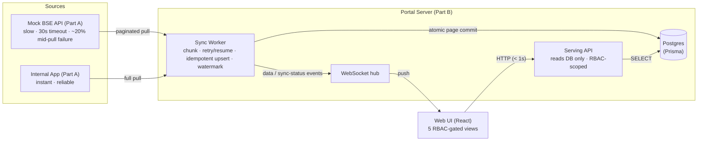

# Architecture — BSE Portal

## The one idea

The BSE feed is slow (5–10 min/pull), times out at 30s, and fails ~20% of the time.
Yet every screen must load in **< 1s even when BSE is down**, and update live.
That rules out reading BSE on the request path. So the system is split in two:

- **Ingestion (write path)** — a background worker mirrors BSE into our own Postgres, slowly and unreliably, but *durably and idempotently*.
- **Serving (read path)** — the portal reads *only* Postgres. It never calls BSE, so it is always fast and always available.

## How each hard requirement is met

| Requirement | Mechanism |
|---|---|
| **Screen loads < 1s, even if BSE is down** | Reads hit Postgres only (measured 8–48ms). The serving API has no code path to BSE. |
| **Open screens update without refresh** | Worker emits a `data` event on every committed page → WebSocket push → the affected view re-fetches from the DB. Initial backfill and later deltas both stream in live. |
| **Correct under 30s timeout** | Each page fetch runs under an `AbortController` capped at `BSE_HTTP_TIMEOUT_MS=30000`. A timed-out page throws and is retried — never hangs. |
| **Correct under partial/mid-pull failure** | The pull is **paginated**. A page that fails (socket reset, non-2xx, truncated JSON) throws; the worker retries it with exponential backoff, resuming from the last committed cursor. A page is only ever *fully parsed or discarded* — never half-committed. |
| **No duplicates / no contradictions** | Business rows use the **external id as primary key**; ingestion is `createMany(skipDuplicates)` / upsert. Retried pages and overlapping incremental windows are therefore idempotent. Page rows + cursor advance happen in **one transaction**, so a crash can't leave the cursor ahead of the data. |
| **Overlapping refreshes** | The worker never runs two cycles at once (`ticking` guard). Incremental trade pulls use a `tradedAt` **watermark**; re-reading the boundary is safe because upserts dedupe. |

## Ingestion detail

- **Sequencing:** `internal → clients → trades`. Trades are only ingested once clients finish, so a `Trade → Client` foreign key can never dangle.
- **Resume state** lives in `SyncState` (per resource): `status`, `cursor` (resume offset), `windowFrom` (the filter the cursor is valid for), `watermark` (max `tradedAt` ingested), plus counters for observability.
- **Clients** are change-detected with a cheap 1-row probe (`total` vs DB count) so we don't re-pull static master data every cycle.
- **Trades** are incremental: each cycle opens a window `from = watermark` and pages to the end; a mid-cycle crash resumes the same window from `cursor`.

## Dynamic RBAC (Org × Role × Feature)

Access is **data, not code**. `Organization → Role → RoleFeature(feature, scope)` is stored in Postgres and resolved per request.

- **Feature** = a screen/capability (`clients`, `trades`, `my_clients`, `employees`, `incentives`, `access_control`).
- **Scope** narrows the rows: `ALL` (everything), `OWN` (the user's own, e.g. their incentive), `MAPPED` (only their mapped clients).
- The **Access Control** screen edits the matrix live; the next request any user makes is re-evaluated against it. Two seeded orgs (Arham, Zenith) intentionally grant the same role key different features — proof nothing is hardcoded.

Incentive = `Σ(brokerage on an RM's mapped clients' trades) × rate` (default 15%), computed with a single `GROUP BY`.

## Why these choices

- **Postgres + Prisma** — relational data (clients↔RMs↔trades), transactional page commits, and a typed schema that doubles as documentation.
- **Own datastore over a cache** — a cache in front of BSE would still miss/expire and block on the slow origin. A mirror is always warm and survives BSE outages completely.
- **WebSocket over polling** — the server already knows the instant new rows commit; pushing is cheaper and lower-latency than every client polling.
